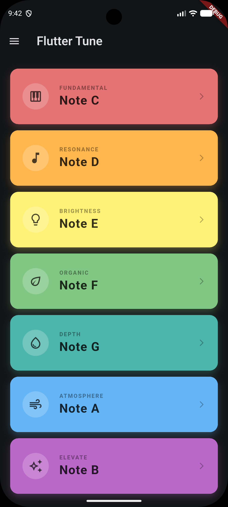

# Flutter Tune 🎵

A simple, colorful, and interactive musical application built with Flutter. This app allows users to play different musical notes by tapping on beautifully designed color-coded cards. 

## 📱 App Preview
*(You can add your screenshot here by dragging and dropping the image into the GitHub editor)*

<p align="center">
  
</p>

## ✨ Features
* **Interactive UI:** A clean, colorful, and highly responsive user interface.
* **Musical Notes:** Plays standard musical notes (C, D, E, F, G, A, B) with clear, high-quality audio.
* **Thematic Design:** Each note is paired with a specific color, icon, and mood descriptor (e.g., Fundamental, Resonance, Brightness) to enhance the user experience.
* **Cross-Platform:** Built with Flutter, making it fully compatible with both Android and iOS devices.

## 🛠️ Tech Stack
* **Framework:** [Flutter](https://flutter.dev/)
* **Language:** [Dart](https://dart.dev/)
* **Audio Package:** Uses an audio player package (like `audioplayers`) to trigger sounds on tap.

## 🚀 Getting Started

To run this project on your local machine, follow these steps:

1. **Clone the repository:**
   ```bash
   git clone [https://github.com/YourUsername/flutter_tune.git](https://github.com/YourUsername/flutter_tune.git)